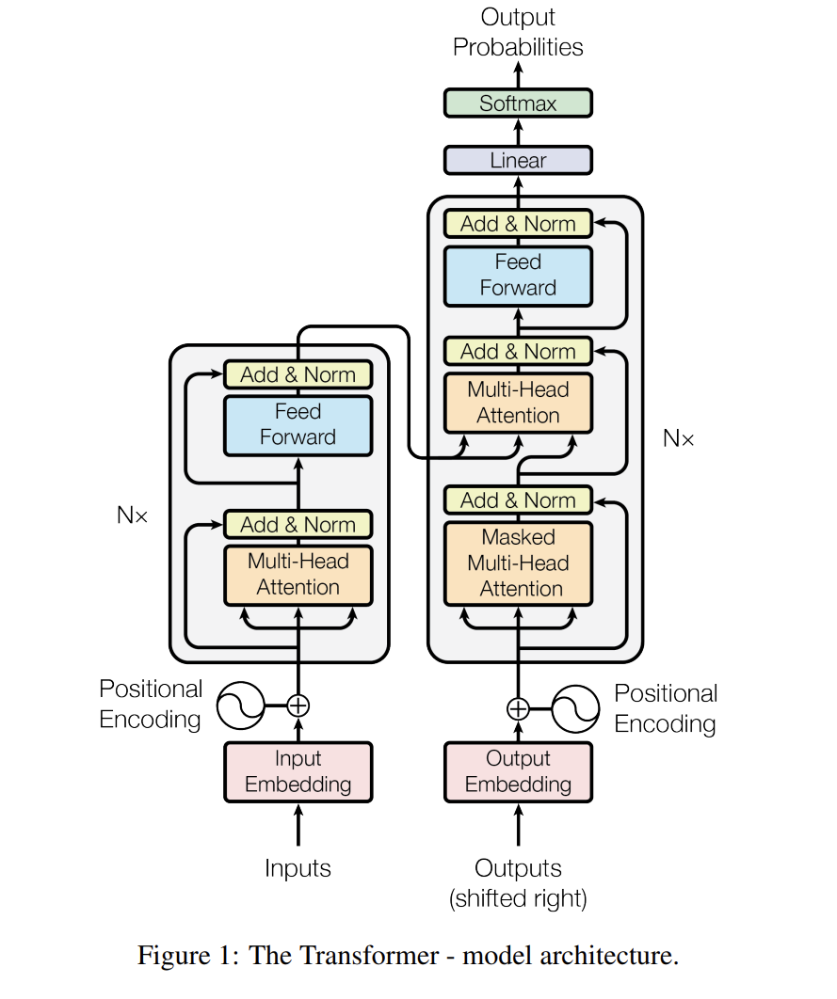

# [Attention Is All You Need](https://arxiv.org/abs/1706.03762)

This repository contains a PyTorch implementation of the Transformer model introduced in the paper [Attention Is All You Need](https://arxiv.org/abs/1706.03762).



---

## Introduction

The Transformer model introduced in "Attention Is All You Need" replaces recurrence and convolutions with self-attention mechanisms, enabling significantly faster training and improved performance on sequence tasks. This repository provides a straightforward implementation using PyTorch, intended for learning and experimentation.

---

## Usage

1. **Training**:

   Use the provided scripts to train the Transformer model on your dataset. Modify the configuration as needed in `config.py`.

   ```bash
   python train.py
   ```

2. **Inference**:

   Run inference using a pre-trained model:

   ```bash
   python inference.py
   ```

3. **Customization**:

   Extend or modify the model by editing `transformer.py` or adding new modules.

---

## Results

The figure below shows the result of training the transformer for 20 epochs.


Additionall, the visualization of attention mechanism is shown below.

1. Encoder Attention Matix
   

   - As we can see when we visualize the attention, the value along the diagonal is high, as it is the dot product of each token with itself. We can also see that the start of sentence token and end of sentence token are not related to any other token, specifically in the initial layers. However, they have some correlation with other token in later layers.

   - Also, as we know each head will watch different aspect of each word(token) as we are distributing the word embedding among the heads equally so that each head will see a different part of the embedding of the word. Thus we hope that they learn different kind of mapping between the words which can be visualized from the above matrix.

2. Decoder Attention Matix
   

   - In the decoder attention matrix, we can see different kind of relation among tokens as shown above.

3. Encoder-Decoder Attention Matix
   

   - The most interesting is the cross attention matrix. This matrix shows how the interaction between encoder and decoder works. We find the cross attention calculated using the keys and the values coming from the encoder while the query is coming from the decoder.

   - Also, this is where the translation occurs and the above matrix shows how the model learns to relate the two translated sentences to each other.

---

## Acknowledgments

I would like to express my gratitude to Umar Jamil for his excellent [explanation](https://youtu.be/bCz4OMemCcA?si=-KzbMT2LhgrzamU0) of the "Attention Is All You Need" paper, which greatly inspired this implementation.

---

## Citations

```bibtex
@misc{Vaswani2017,
    author = {Vaswani A., Shazeer N., Parmar N., Uszkoreit J., Jones L., Gomez A. N., Kaiser L., & Polosukhin I.},
    title = {Attention Is All You Need},
    year   = {2017},
    eprint = {arXiv:1706.03762},
}
```
